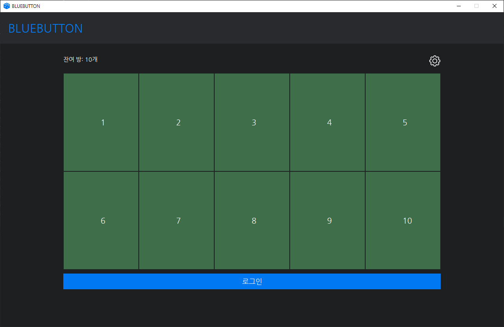
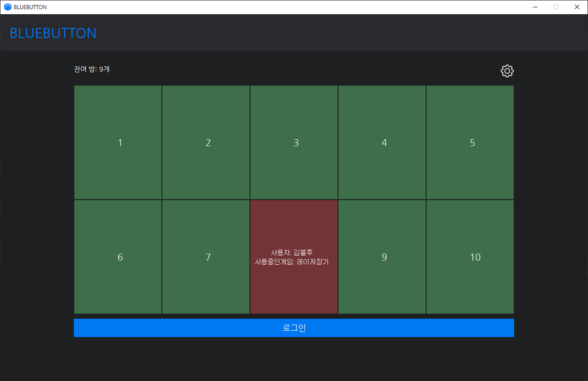
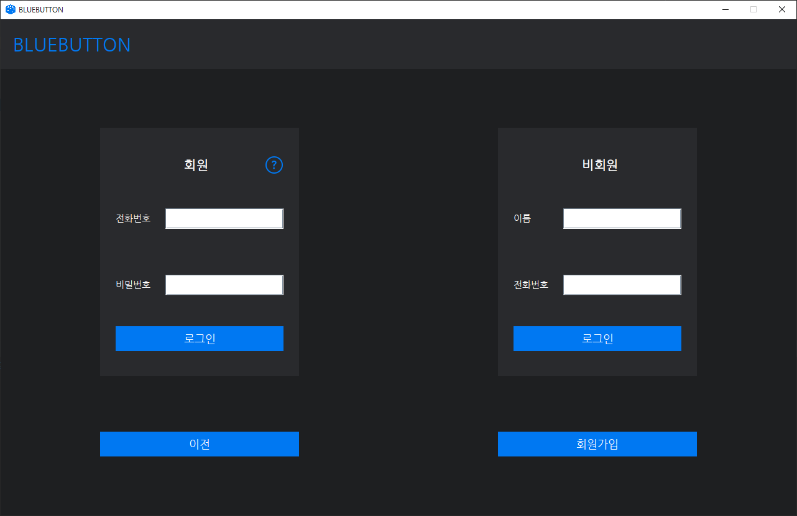
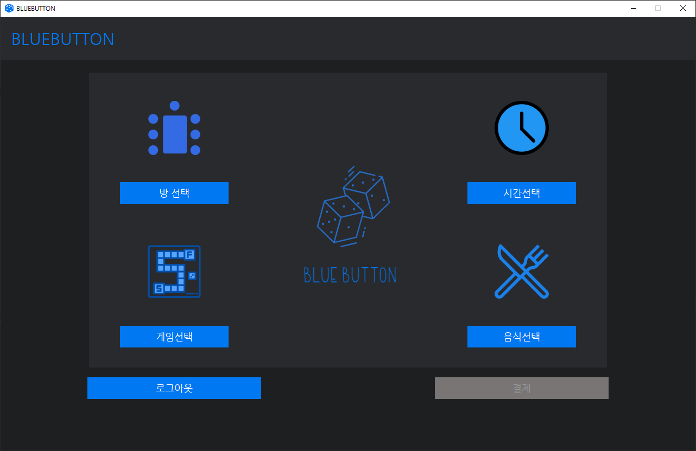
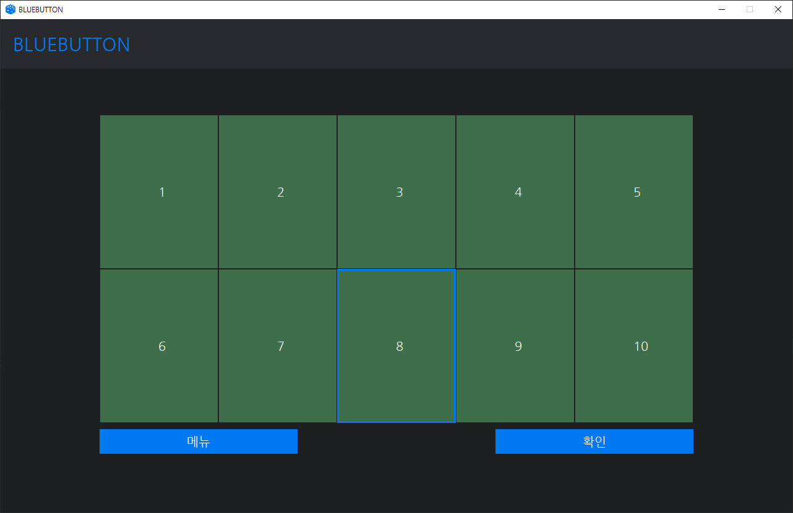
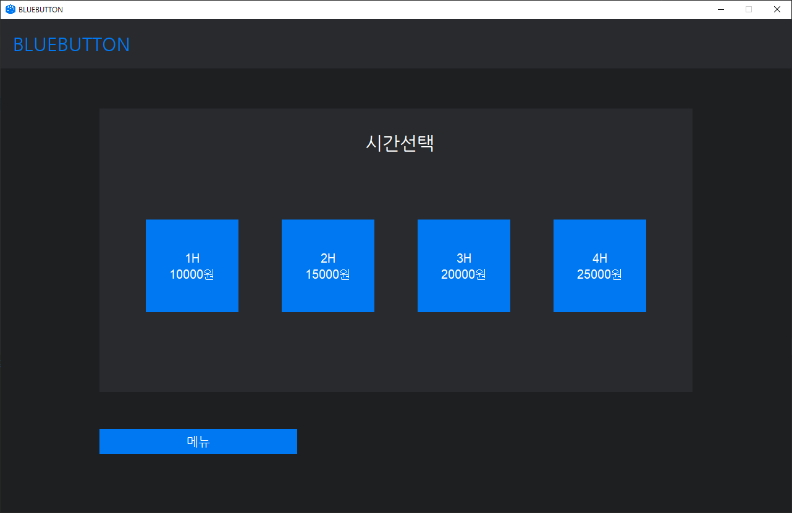
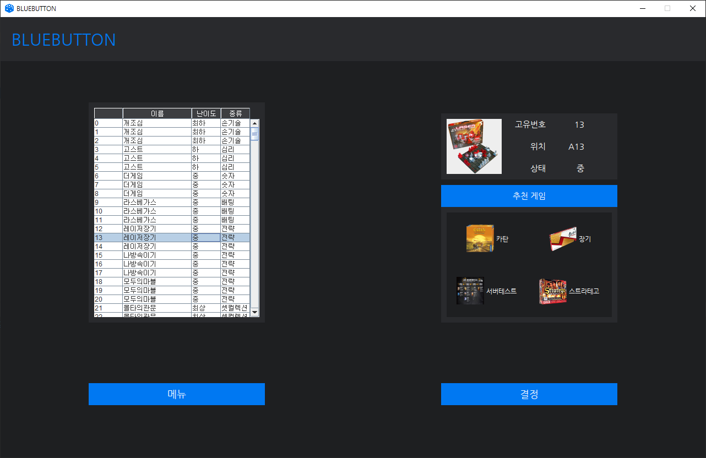
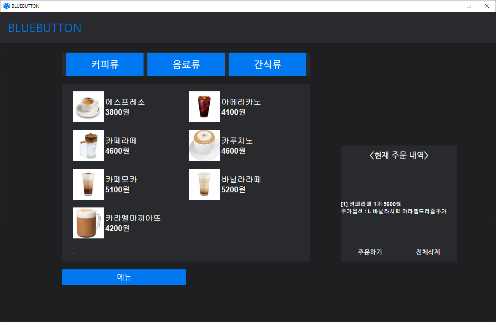
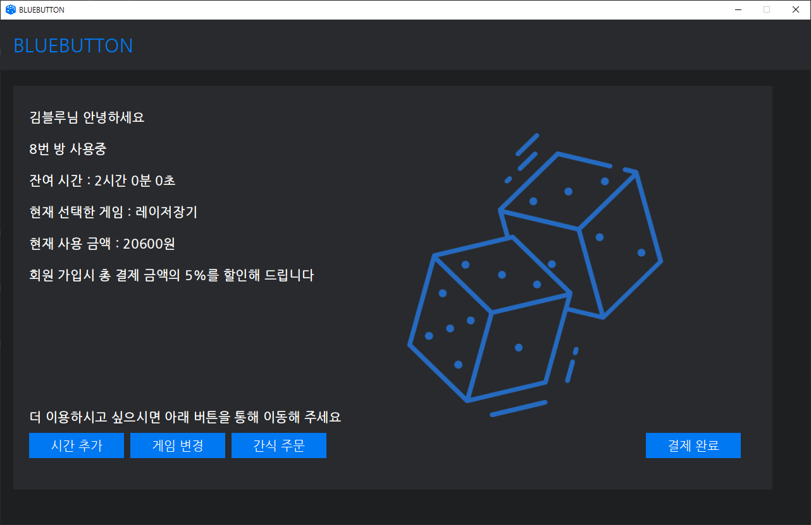

# BlueButton

## Table of Contents

- [Overview](#overview)
- [Main Window](#main-window)
- [Login Window](#login-window)
- [Selection Windows](#selection-windows)
  - [Room Selection Window](#room-selection-window)
  - [Time Selection Window](#time-selection-window)
  - [Game Selection Window](#game-selection-window)
  - [Snack Selection Window](#snack-selection-window)
- [Summary Window](#summary-window)

## Overview

BlueButton is a project that was conducted as part of an object-oriented programming class.
We wanted to make a kiosk that can be used in a board game cafe, and the purpose was to completely implement the reservation function. It has been worked with IntelliJ IDEA and is recommended to run it using JAVA 18.

## Main Window

The window that appears when you run the program, and you can check the remaining rooms. If a reserved room exists, it will be displayed in red as shown below.

## Login Window

Login is divided into member login and non-member login. Membership information is stored in 'member.txt' in the top-level directory.

## Selection Windows

This is the driveway for selecting rooms, time, games, and snacks after logging in. Once all four options have been selected, the payment button will be activated.

### Room Selection Window

The window allows you to select the game room you want. The selectable room appears in green, and the non-selectable room appears in red.

### Time Selection Window

The window allows you to select the desired time.

### Game Selection Window

The window allows you to select the game what you want. Selecting a game in the table displays information about the game and recommended games.

### Snack Selection Window

This window allows you to order snacks. When you select the product you want to order, an additional menu appears where you can select detailed options.

## Summary Window

This window shows a summary of previously selected orders.
